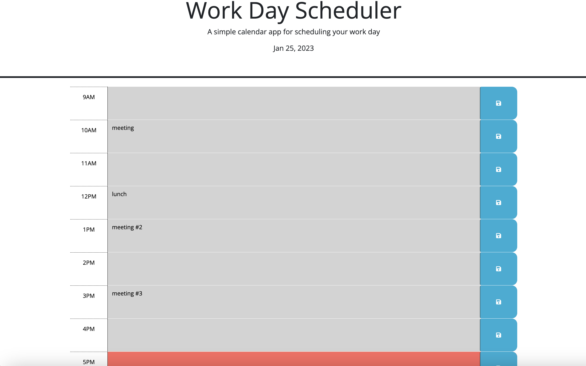

# Work Day Scheduler Week 5

## **Description**

This application is a work day scheduler. Users can input their schedule which will then be saved. Each time block is color coded to represent the past, present and future.

## **Installation** 

N/A

## ## **Usage**

Users simply click on the the text area of the time block that corresponds with the time of their event and click the save button on the right to save the changes. 

>### To view the deployed site click [here](https://sadiemantlo.github.io/work-day-scheduler-week5/)

Screenshot was take at 5pm so it only shows past and present color coding.